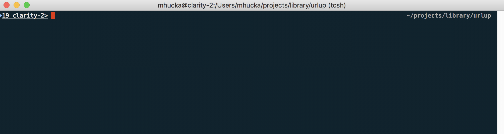

urlup
=====

Urlup is a utility program and Python 3 package to dereference URLs and determine their final destinations after following redirections.  _Urlup_ can be pronounced "_urrrl-up_".

*Authors*:      [Michael Hucka](http://github.com/mhucka)<br>
*Repository*:   [https://github.com/caltechlibrary/urlup](https://github.com/caltechlibrary/urlup)<br>
*License*:      BSD 3-clause license &ndash; see the [LICENSE](LICENSE) file for more information

[](https://choosealicense.com/licenses/bsd-3-clause)
[](http://shields.io)
[](https://pypi.org/project/topi/)
[](https://github.com/caltechlibrary/urlup/releases)
[](https://data.caltech.edu/records/1897)


☀ Introduction
-----------------------------

Sometimes we have a list of URLs and we need to find out the ultimate destinations after any redirections have taken place. _Urlup_ is a simple program to dereference a list of URLs for that purpose.  It handles EZproxy proxied URLs (a common type of proxy used by institutional libraries).  It provides diagnostics and HTTP status codes if desired.  It can be used from the command line, and it also provides a Python 3 module that can be called programmatically.


✺ Installation instructions
---------------------------

The instructions below assume you have a Python interpreter installed on your computer; if that's not the case, please first [install Python version 3](INSTALL-Python3.md) and familiarize yourself with running Python programs on your system.

On **Linux**, **macOS**, and **Windows** operating systems, you should be able to install `urlup` with [`pip`](https://pip.pypa.io/en/stable/installing/).  To install `urlup` from the [Python package repository (PyPI)](https://pypi.org), run the following command:
```
python3 -m pip install urlup
```

As an alternative to getting it from [PyPI](https://pypi.org), you can use `pip` to install `urlup` directly from GitHub, like this:
```sh
python3 -m pip install git+https://github.com/caltechlibrary/urlup.git
```


▶︎ Basic operation
------------------

_Urlup_ provides a command-line utility as well as a library.

### Command-line use

The command-line utility is called `urlup` and can be used from a terminal shell.  It prints help text when given the `-h` option (`/h` on Windows).  For a simple, quick check of a few URLs, you can simply provide the URLs on the command line:

```csh
# urlup http://sbml.org
No output file given -- results won't be saved.
http://sbml.org ==> http://sbml.org/Main_Page [301]
Done.
```

The output produced by `urlup` will consist of a line for each URL given, with the original and final URLs printed along with the HTTP status code received when the original URL is first contacted.  If given the `-e` option (`/e` on Windows), it will also print more details about the meaning of the HTTP status received.  For example:

```csh
# urlup -e caltech.edu www.caltech.edu
No output file specified; results won't be saved.
caltech.edu ==> http://www.caltech.edu/
   [status code 302 = This response code means that the URI of
   requested resource has been changed temporarily. New changes in the
   URI might be made in the future. Therefore, this same URI should be
   used by the client in future requests.]
www.caltech.edu ==> http://www.caltech.edu
   [status code 200 = The request has succeeded.]
```

The typical usage for `urlup` is to provide it with a list of URLs in a file (one per line) with the `-i` option (`/i` on Windows), and to tell it to write the results to a CSV file with the `-o` option (`/o` on Windows).

```csh
# urlup  -i original_urls.txt  -o final_urls.csv
```

Here is a screen cast to demonstrate. Click on the following image:

[](https://asciinema.org/a/KoUQHTVrzWpSK7aNL3P3TfhTF)


### Proxy handling

If the URLs to be dereference involve a proxy server (such as [EZproxy](https://www.oclc.org/en/ezproxy.html), a common type of proxy used by libraries), it will be necessary for Urlup to obtain login credentials for the proxy server.  Urlup uses your operating system's keyring/keychain functionality to ask for and store the credentials.  The first time Urlup needs to get proxy credentials, it will prompt you for the credentials and then store them using your operating system's keyring/keychain functionality, so that it does not have to prompt again in the future.  You can disable the use of the keyring/keychain by running Urlup with the `-X` (or `/X` on Windows) command-line flag.  It is also possible to supply the information directly on the command line using the `-u` and `-p` options (or `/u` and `/p` on Windows), but this is discouraged because it is insecure on multiuser computer systems.


### Module API 

Urlup provides a single function, `updated_urls()`, that can be called from other Python programs to dereference one or more URLs.  If given a single URL, it returns a single result; if give a list, it returns a list of results.  Each result is in the form of a named tuple called `UrlData`.  The tuple has 4 fields:

* `original`: the given URL
* `final`: the URL after dereferencing and following redirections
* `status` integer HTTP status code obtained on the `original` URL
* `error`: the error (if any) encountered while trying to dereference the URL

Here is a simple example of using `updated_urls()` in Python:

```python
from urlup import updated_urls

for result in updated_urls(['http://caltech.edu', 'http://notarealurl.nowhere']):
     print('Original URL: ' + result.original)
     if result.error:
         print('Error: ' + result.error)
     else:
         print('Final URL: ' + result.final)
         print('Status code: ' + str(result.status))
     print('')
```

The code above will print the following output when run:

```
Original URL: http://caltech.edu
Final URL: http://www.caltech.edu/
Status code: 302

Original URL: http://notarealurl.nowhere
Error: Cannot resolve host name
```

The function `updated_urls` takes the following arguments:

* _urls_: a single URL or a list of URLs
* _cookies_: a dictionary of key-value pairs representing cookies to be set when making network connections
* _headers_: a dictionary of headers to add to every URL lookup
* _proxy_user__: a user login for a proxy, if a proxy will be encountered
* _proxy_pswd_: a password for the proxy, if a proxy will be encountered
* _use_keyring_: whether the system keyring/keychain should be used (default is `False`)
* _quiet_: whether to print messages while working (default is `True`, meaning, don't print a lot of messages)
* _explain_: whether to explain HTTP status codes encountered (default is `False`, meaning, don't print explanations)
* _colorize_: whether to color-code any messages printed (default is `False`)


⁇ Getting help and support
--------------------------

If you find an issue, please submit it in [the GitHub issue tracker](https://github.com/caltechlibrary/urlup/issues) for this repository.


★ Do you like it?
------------------

If you like this software, don't forget to give this repo a star on GitHub to show your support!


☺︎ Acknowledgments
-----------------------

The vector artwork used as a logo for Urlup was created by [Eynav Raphael](https://thenounproject.com/graphicool/) and obtained from [The Noun Project](https://thenounproject.com/term/url/1581155/).  It is licensed under the Creative Commons [CC-BY 3.0](https://creativecommons.org/licenses/by/3.0/) license.

Urlup was makes use of numerous open-source packages, without which it would have been effectively impossible to develop Urlup with the resources we had.  We want to acknowledge this debt.  In alphabetical order, the packages are:

* [colorama](https://github.com/tartley/colorama) &ndash; makes ANSI escape character sequences work under MS Windows terminals
* [ipdb](https://github.com/gotcha/ipdb) &ndash; the IPython debugger
* [keyring](https://github.com/jaraco/keyring) &ndash; access the system keyring service from Python
* [plac](http://micheles.github.io/plac/) &ndash; a command line argument parser
* [PyInstaller](http://www.pyinstaller.org) &ndash; a packaging program that creates standalone applications from Python programs for Windows, macOS, Linux and other platforms
* [requests](http://docs.python-requests.org) &ndash; an HTTP library for Python
* [setuptools](https://github.com/pypa/setuptools) &ndash; library for `setup.py`
* [termcolor](https://pypi.org/project/termcolor/) &ndash; ANSI color formatting for output in terminal
* [uritools](https://github.com/tkem/uritools/) &ndash; RFC 3986 compliant, Unicode-aware, scheme-agnostic replacement for urlparse
* [validators](https://github.com/kvesteri/validators) &ndash; Python data validators for humans


☮︎ Copyright and license
---------------------

Copyright (C) 2018-2021, Caltech.  This software is freely distributed under a BSD 3-clause license.  Please see the [LICENSE](LICENSE) file for more information.
    
<div align="center">
  <a href="https://www.caltech.edu">
    
  </a>
</div>
